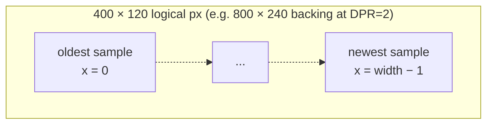

# @zakkster/lite-canvas-graph

[](https://www.npmjs.com/package/@zakkster/lite-canvas-graph)
[](https://bundlephobia.com/result?p=@zakkster/lite-canvas-graph)
[](https://www.npmjs.com/package/@zakkster/lite-canvas-graph)
[](https://www.npmjs.com/package/@zakkster/lite-canvas-graph)


[](https://opensource.org/licenses/MIT)

**Zero-GC canvas renderer for time-series telemetry.**

One scratchpad allocation per resize. Nothing in the hot path. Renders straight from a `RingBuffer` via `copyTo` — no array conversion, no `Array.from`, no `[].slice()`. Decimates to a per-column min/max envelope when sample count exceeds pixel width, the way oscilloscopes and audio waveform views have always done it.

```js
import { RingBuffer } from '@zakkster/lite-ring-buffer';
import { CanvasGraph } from '@zakkster/lite-canvas-graph';

const canvas = document.getElementById('telemetry-canvas');
const ring = new RingBuffer(1024);
const graph = new CanvasGraph(canvas, 400, 120, { stroke: '#0ff' });

let lastTime = performance.now();

function renderLoop(currentTime) {
    const delta = currentTime - lastTime;
    lastTime = currentTime;

    ring.push(delta);
    graph.render(ring, 16, { minValue: 0 }); // 0..16ms frame budget baseline

    requestAnimationFrame(renderLoop);
}

requestAnimationFrame(renderLoop);
```

---

## Contents

- [Why](#why) · [Install](#install) · [Quick start](#quick-start)
- [How it works](#how-it-works)
- [API reference](#api-reference)
- [Edge cases & guarantees](#edge-cases--guarantees)
- [FAQ](#faq)
- [License](#license)

---

## Why

A "live graph" component looks innocent until you profile it.

The naive approach — copy samples into an array, map over them, call `lineTo` — allocates a fresh array and a fresh path object every single frame. At 60Hz with a 1024-sample window that's **60,000 allocations per second** before you've drawn a pixel. The GC will eventually pause your render loop to clean it up, and your "smooth" graph stutters at exactly the wrong moment.

```mermaid
flowchart LR
    subgraph Naive["Naive approach (per frame)"]
        A1[ring → Array.from] --> A2[points = data.map]
        A2 --> A3[ctx.beginPath]
        A3 --> A4[for .. lineTo]
        A4 --> A5[stroke]
        A5 --> GC[GC pause]
    end
    subgraph Lite["lite-canvas-graph (per frame)"]
        B1[ring.copyTo&#40;scratch&#41;] --> B2[ctx.beginPath]
        B2 --> B3[lineTo loop]
        B3 --> B4[stroke]
    end
```



`lite-canvas-graph` allocates once — a `Float32Array` sized to the ring's capacity, plus a per-column min/max scratchpad sized to the canvas width. After that the render path is a tight numeric loop and direct canvas calls. No object graphs, no arrays, no GC churn.

For windows larger than the canvas width (the common case — you have 4096 telemetry samples but only 400 horizontal pixels), the renderer **decimates**: each column collects min/max of all samples that map to it and draws a single vertical line from min to max. This is the correct convention for oscilloscope and audio-waveform displays. It preserves spike visibility — a single outlier in a column still pushes the envelope to the edge — where naive subsampling would silently drop it.

---

## Install

```bash
npm i @zakkster/lite-canvas-graph @zakkster/lite-ring-buffer
```

ESM only. Zero runtime dependencies (the ring buffer is a peer dep — bring your own).

---

## Quick start

```js
import { RingBuffer }  from '@zakkster/lite-ring-buffer';
import { CanvasGraph } from '@zakkster/lite-canvas-graph';

const canvas = document.getElementById('chart');
const ring   = new RingBuffer(1024);                   // power-of-2-rounded
const graph  = new CanvasGraph(canvas, 400, 120, {
  background: '#111',
  stroke:     '#00ffcc',
  lineWidth:  1,
});

// Push samples from anywhere — performance observer, websocket, RAF, ...
performance.mark && setInterval(() => {
  ring.push(performance.now() % 1000);                 // toy data
}, 16);

// Draw at your preferred cadence.
function frame() {
  graph.render(ring, 1000, { minValue: 0 });
  requestAnimationFrame(frame);
}
requestAnimationFrame(frame);
```

### Worker / OffscreenCanvas

`window` is never referenced. In a worker, pass `dpr` explicitly:

```js
const off   = canvas.transferControlToOffscreen();
// inside the worker:
const graph = new CanvasGraph(off, 400, 120, { dpr: 2 });
```

### Overlaying labels

Use `labelBitmapHook` to draw axis labels, units, or peak markers on top of the trace without forcing them into the core renderer:

```js
graph.labelBitmapHook = (ctx, maxValue, w, h) => {
  ctx.fillStyle = '#888';
  ctx.font = '10px monospace';
  ctx.fillText(`${maxValue.toFixed(1)} ms`, 4, 12);
};
```

---

## How it works

### Layout



Time flows left → right. Index `0` of the ring (oldest) lands at `x = 0`, index `count - 1` (newest) at `x = width - 1`. Standard direction for telemetry; the most-recent reading is always at the right edge where your eye expects it.

### Direct vs decimated

The renderer picks one of two modes per frame:

```mermaid
flowchart LR
    Start[render&#40;&#41;] --> Q{n &gt; width?}
    Q -- yes --> Dec[Decimated<br/>per-column min/max envelope]
    Q -- no  --> Dir[Direct<br/>polyline moveTo + lineTo]
```



**Direct** mode is the obvious one: one `moveTo` for the first sample, `lineTo` for every subsequent sample. Used when you have at most one sample per pixel column. NaN samples break the path (no fake connecting lines).

**Decimated** mode is what makes the renderer correct at scale. For each pixel column it walks every sample whose index maps to that column, tracks `min` and `max`, and draws a single vertical line from `min` to `max`. Empty columns leave a gap rather than fake-filling with neighbours — if your data has a hole, the graph shows a hole.

### Allocations

| Where        | What                                  | When                       |
|--------------|---------------------------------------|----------------------------|
| Constructor  | nothing                               | —                          |
| First render | `Float32Array(ring.capacity)`         | once, grown on capacity ↑  |
| First render | `Float32Array(width * 2)` (decimated) | once, grown on width ↑     |
| Resize       | re-grow pixel scratch on next render  | per resize                 |
| Per frame    | **0**                                 | always                     |

The `options` object literal in `render(ring, max, { decimate: false })` is the only thing the V8 inliner has to deal with — the renderer itself reads `options.decimate` directly without destructuring, so passing or omitting it changes nothing in the steady state.

---

## API reference

### `new CanvasGraph(canvas, width, height, options?)`

| Param  | Type                                       | Notes                                  |
|--------|--------------------------------------------|----------------------------------------|
| canvas | `HTMLCanvasElement \| OffscreenCanvas`     | required                               |
| width  | `number`                                   | logical CSS pixels, ≥ 1                |
| height | `number`                                   | logical CSS pixels, ≥ 1                |
| options.dpr        | `number?`                        | overrides `globalThis.devicePixelRatio` |
| options.background | `string?`                        | default `'#111'`                       |
| options.stroke     | `string?`                        | default `'#00ffcc'`                    |
| options.lineWidth  | `number?`                        | default `1`                            |

Throws `TypeError` on missing canvas, `RangeError` on bad dimensions.

### `.render(ringBuffer, maxValue, options?)`

The hot path. Allocation-free in the steady state.

| Param               | Type           | Notes                                    |
|---------------------|----------------|------------------------------------------|
| ringBuffer          | `RingBuffer`   | from `@zakkster/lite-ring-buffer`        |
| maxValue            | `number`       | upper bound of the value range           |
| options.decimate    | `boolean?`     | default `true` (envelope when n > width) |
| options.minValue    | `number?`      | default `0`                              |

Values outside `[minValue, maxValue]` are clamped to the visible range. NaN samples break the polyline (direct mode) and are skipped (decimated mode). A degenerate range (`maxValue <= minValue`) clears the canvas and bails — labels still run.

### `.resize(width, height)`

Updates the logical drawing area. Forces backing-store reconfig and pixel-scratch reallocation on the next `render()`. No-op when dimensions are unchanged.

### `.labelBitmapHook`

`(ctx, maxValue, width, height) => void` — runs at the end of each `render()`, drawing on top of the trace. Set to `null` (default) to skip.

### `.destroy()`

Releases scratchpads and references. Idempotent. Calling any other method afterwards is undefined behaviour.

---

## Edge cases & guarantees

- **Single sample (`n === 1`).** Direct mode emits a degenerate `lineTo` so `lineCap='square'` produces a visible dot at `lineWidth` pixels. Without this, a lone `moveTo` would render nothing.
- **NaN samples.** Direct: break the path (no fake interpolation). Decimated: skipped during column accumulation; columns with only NaN samples remain empty (gap).
- **Out-of-range values.** Clamped to `[minValue, maxValue]`. The trace pins to the top or bottom edge instead of overshooting; this is what you want for "value capped" indicators.
- **`maxValue <= minValue`.** Renderer clears the canvas, runs `labelBitmapHook` if set, returns. No throw — invalid axes happen during init/resize race conditions and shouldn't crash your loop.
- **DPR changes mid-session.** Detected at the start of each `render()`. Triggers a one-time backing-store reconfig + transform reset. Cheap.
- **Capacity growth.** If you push to a ring buffer whose capacity grew (you replaced it with a bigger one), the sample scratch is re-grown on next render. `_pixelScratch` only re-grows on resize.
- **`alpha: false` context.** The renderer requests an opaque context, which is faster on most GPUs. `background` colour is therefore guaranteed visible — there is no transparency to bleed through to the page beneath.

---

## FAQ

**Why not just use Chart.js / uPlot / d3?**

Those are general-purpose charting libraries with axes, tooltips, animations, legends, themes — and per-frame allocation. This package is one thing: a zero-GC trace renderer for live telemetry. It composes nicely with axes drawn in `labelBitmapHook` if you need them, but it doesn't ship them.

**Can I render multiple traces?**

Construct multiple `CanvasGraph` instances over different canvases, or layer them — the cheapest way is one canvas per trace stacked in CSS, since each one keeps its own scratchpads and DPR state.

**Does it support log scale?**

Not directly. Pre-transform your samples before pushing them: `ring.push(Math.log10(rawValue))`. Set `minValue` / `maxValue` in log space.

**Can I scroll the view backwards in time?**

This renderer always shows "the current contents of the ring buffer." If you want a scrubbing/scrollback view, you want a different component — one that buffers historical data outside the live ring.

**Why `Float32` and not `Float64`?**

Halves memory bandwidth, doubles the cache density of the scratchpad, and 7 significant decimal digits is more than your screen can show. If you need 64-bit precision for sample storage, `lite-canvas-graph` is the wrong layer.

---

## License

MIT © Zahary Shinikchiev
